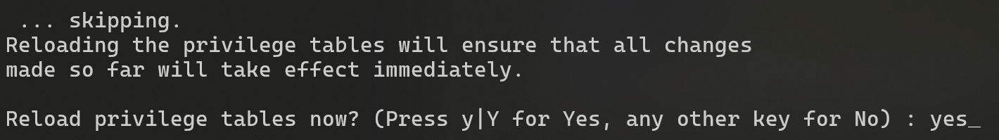

# WEBTE2 Konfigurácia serveru

## Úvod 
Konfigurácia webového servera a "LEMP Stack-u" (Linux-Nginx-MySQL-PHP) pre predmet WEBTE2. Server je dostupný na verejnej IP adrese v tvare `147.175.105.XX`. Server má priradené aj doménové meno v tvare `nodeXX.webte.fei.stuba.sk` . Znaky **XX** v doménovom tvare adresy sú nahradené posledným číslom z IP adresy (môžu to byť 2 alebo 3 číslice).

Na server je možné prihlásiť sa prihlasovacím menom (login) a heslom, **ktorými sa prihlasujete do AIS**.

**Nemeňte heslo priradené k vášmu kontu!**

## Pripojenie k serveru pomocou SSH

Cez terminál/príkazový riadok/kozolu (CMD/Windows terminal/Bash/Terminal...) sa pripojte k svojmu pridelenému serveru. Namiesto `XX` zadajte **vaše posledné číslo z IP adresy**.

```sh
ssh username@147.175.105.XX
```

Násldedne budete vyzvaní zadať heslo. Pri prvom prihlásení sa zobrazí takéto, alebo podobné upozornenie:

```
The authenticity of host '147.175.105.XX (147.175.105.XX)' can't be established.
ED25519 key fingerprint is SHA256:lhGu321iNdaG+aoYfcIXf4qpJCIMkKDj49HTF1oqwic.
The key is not known by any other names.
Are you sure you want to continue connecting (yes/no/[fingerprint])?
```

Napíšte do konzoly `yes`, stlačte enter a následne sa zobrazí výzva k zadaniu hesla. Pri zadávaní hesla nie sú viditeľné znaky, preto dbajte na správne zadanie hesla. **Nemeňte heslo priradené k vášmu kontu!**

## Update systému
Po prihlásení systém aktualizujte. Príkaz `sudo` vyžaduje zadanie hesla. Použite vaše prihlasovacie heslo. 

```sh
sudo apt update && sudo apt -y upgrade
```

## Inštalácia balíkov LEMP stacku
Pridanie repozitárov pre novšie verzie PHP a PhpMyAdmin.
```sh
sudo add-apt-repository ppa:ondrej/php
sudo add-apt-repository ppa:phpmyadmin/ppa
```
**Každý príkaz zadávajte samostatne.** Pri pridávaní repozitárov jazyka PHP sa objaví výpis:

```sh
PPA publishes dbgsym, you may need to include 'main/debug' component
Repository: 'Types: deb
URIs: https://ppa.launchpadcontent.net/ondrej/php/ubuntu/
Suites: noble
Components: main
'
Description:
Co-installable PHP versions: PHP 5.6, PHP 7.x, PHP 8.x and most requested extensions are included. Only Supported Ubuntu Releases (https://wiki.ubuntu.com/Releases) are provided.

Debian oldstable and stable packages are provided as well: https://deb.sury.org/#debian-dpa

You can get more information about the packages at https://deb.sury.org

BUGS&FEATURES: This PPA now has a issue tracker:
https://deb.sury.org/#bug-reporting

CAVEATS:
1. If you are using php-gearman, you need to add ppa:ondrej/pkg-gearman
2. If you are using apache2, you are advised to add ppa:ondrej/apache2
3. If you are using nginx, you are advised to add ppa:ondrej/nginx-mainline
   or ppa:ondrej/nginx

PLEASE READ: If you like my work and want to give me a little motivation, please consider donating regularly: https://donate.sury.org/

WARNING: add-apt-repository is broken with non-UTF-8 locales, see
https://github.com/oerdnj/deb.sury.org/issues/56 for workaround:

# LC_ALL=C.UTF-8 add-apt-repository ppa:ondrej/php
More info: https://launchpad.net/~ondrej/+archive/ubuntu/php
Adding repository.
Press [ENTER] to continue or Ctrl-c to cancel.
```

Stlačte ENTER a prebehne pridanie repozitára.

Pri pridávaní PHPMyAdmin repozitára sa objaví výpis:

```sh
Repository: 'Types: deb
URIs: https://ppa.launchpadcontent.net/phpmyadmin/ppa/ubuntu/
Suites: noble
Components: main
'
Description:
Packages for Ubuntu, maintained on salsa.debian.org/phpmyadmin-team

You can use this packages on production at your own risk, please wait until they are released through the official Ubuntu-channels for additional safety.

That said packages are normally the same as in Ubuntu or Debian.

-> Find more information about this PPA on our wiki:

https://github.com/phpmyadmin/phpmyadmin/wiki/DebianUbuntu


More info: https://launchpad.net/~phpmyadmin/+archive/ubuntu/ppa
Adding repository.
Press [ENTER] to continue or Ctrl-c to cancel.
```

Znovu stlačte ENTER a repozitár sa pridá do systému. Napokon zavolajte príkaz pre aktualizáciu systémových balíkov:

```sh
sudo apt update && sudo apt -y upgrade
```

### MySQL Databázový server
Nainštalujte MySQL server zadaním príkazu
```sh
sudo apt install -y mysql-server
```

Inštalácia môže trvať dlhšie. Po úspešnej inštalácii spustite skript na inicializáciu a zabezpečenie `mysql-server` databázového serveru:
```sh
sudo mysql_secure_installation
```
**POZOR! Počas inštalácie pozorne sledujte otázky a zadajte korektné odpovede!**

**Odpovede na otázky počas konfigurácie:**
- Setup validate password component? - **no**

- Remove anonymous user? - **yes**

- Disallow root login remotely? - **yes**

- Remove test database and access to it? - **no**

- Reload privilege tables now? - **yes**



Po skončení procesu sa pripojte ku MySQL konzole:
```sh
sudo mysql
```
Prompt sa zmení na `mysql>`: 
```sh
Welcome to the MySQL monitor.  Commands end with ; or \g.
Your MySQL connection id is 10
Server version: 8.0.41-0ubuntu0.24.04.1 (Ubuntu)

Copyright (c) 2000, 2025, Oracle and/or its affiliates.

Oracle is a registered trademark of Oracle Corporation and/or its
affiliates. Other names may be trademarks of their respective
owners.

Type 'help;' or '\h' for help. Type '\c' to clear the current input statement.

mysql>
```
Vytvorte si nového používateľa pre prístup a správu databáz. Vytvorte si používateľa s rovnakým menom, s akým sa prihlasujete na server. Heslo si zvoľte iné ako slovo `password` a iné ako do AIS. **Heslo si dobre zapamätajte a niekde zapíšte!** Príkazy nekopírujte ale prepíšte si ich ručne, dbajte na správne znaky - najmä apostrofy pri identifikátoroch mena, hesla a hostu a bodkočiarku na konci príkazov.
```sh
mysql> CREATE USER 'username'@'localhost' IDENTIFIED BY 'password';
```
Pridanie privilégií pre prácu s databázami:
```sh
mysql> GRANT ALL PRIVILEGES ON *.* TO 'username'@'localhost';
mysql> FLUSH PRIVILEGES;
```
Opustenie konzoly MySQL pomocou `Ctrl + d` alebo `exit`.

Pre kontrolu sa prihláste do MySQL konzoly pod novým používateľom a jeho heslom (tým, ktorého ste práve vytvorili):
```sh
mysql -u username -p
```

### Nginx a PHP interpreter

Nainštalujte webový server Nginx spolu s interpreterom jazyka PHP a textovým editorom Nano:
```sh
sudo apt install -y nginx php-fpm nano
```

Po navštívení vašej IP adresy vo webovom prehliadači alebo `nodeXX.webte.fei.stuba.sk` (pri nahradení **XX** za vaše posledné číslo z IP adresy) by webový prehliadač mal zobrazovať:


Potom pridajte používateľa do skupiny www-data:
```sh
sudo usermod -aG www-data $USER
```
Zmena sa prejaví až pri novej relácii - odhlásení a prihlásení alebo reštarte. Pretože sme inštalovali aj nové balíky, reštartujte server príkazom
```sh
sudo reboot now
```
Reštart systému ukončí reláciu - "vyhodí" vás zo serveru. Je treba počkať pár sekúnd a znovu sa [prihlásiť cez ssh](#pripojenie-k-serveru-pomocou-ssh).
Po prihlásení a zadaní príkazu:

```sh
groups
```
by výstup mal vyzerať:
```sh
username sudo www-data
```

Pre overenie inštalácie PHP zadajte príkaz `php -v`, ktorý by mal vrátiť výstup:
```sh
PHP 8.3.16 (cli) (built: Jan 19 2025 13:45:59) (NTS)
Copyright (c) The PHP Group
Zend Engine v4.3.16, Copyright (c) Zend Technologies
    with Zend OPcache v8.3.16, Copyright (c), by Zend Technologies
```

### Vytvorenie adresára pre webové stránky
Adresáre a skripty z tohoto umiestnenia sa budú zobrazovať po navštívení pridelenej domény. Pre zapisovanie do tohoto adresára a korektné zobrazovanie webovým serverom, musí adresár patriť pod skupinu a používateľa `www-data`.

```sh
cd /var
sudo chown -R www-data:www-data www/
sudo chmod g+w -R www/
```

Po zmene oprávnení je možné zapisovať do adresára ```/var/www``` bez sudo privilégií. Vytvoríme následne adresár pre našu doménu. Nezabudnite nahradiť **XX** posledným číselným segmentom z vašej IP adresy:
```sh
cd /var/www
mkdir nodeXX.webte.fei.stuba.sk
cd nodeXX.webte.fei.stuba.sk
```

Vytvoríme jednoduchý PHP skript, ktorý nazveme `index.php` do ktorého vložíme výpis textu Hello World. Súbor vytvoríme pomocou editora `nano`:
```sh
nano index.php
```
Otvorí sa textový editor a vložíme do neho text skriptu:
```php
<?php
	echo "Hello world!"
?>
```
Uložíme pomocou `Ctrl+o` a ukončíme editor pomocou `Ctrl+x`.

### Vytvorenie Virtual host konfigurácie pre URL
Aby webový server vedel, v ktorom adresári sa nachádzajú PHP skripty stránok a ktorý proces má byť použitý na interpretáciu týchto súborov, musíme vytvoriť tzv. Virtual Host Configuration pre Nginx. Ide o súbor, ktorý hovorí, kde sa nachádzajú súbory a adresáre stránok a cesty k interpreteru. Vytvoríme nový súbor - reťazec **XX** nahraďte prideleným číslom podľa IP adresy:

```sh
sudo nano /etc/nginx/sites-available/nodeXX.webte.fei.stuba.sk
```
 
Do nového súboru vložte nasledovný text a zameňe všetky reťazce **XX** za posledný číselný segment priradenej IP adresy:

```sh
server {
       listen 80;
       listen [::]:80;

       server_name nodeXX.webte.fei.stuba.sk;

       rewrite ^ https://$server_name$request_uri? permanent;
}

server {
        listen 443 ssl;
        listen [::]:443 ssl;

        server_name nodeXX.webte.fei.stuba.sk;

        access_log /var/log/nginx/access.log;
        error_log  /var/log/nginx/error.log info;

        root /var/www/nodeXX.webte.fei.stuba.sk;
        index index.php index.html;

        ssl_certificate /etc/ssl/certs/webte_fei_stuba_sk.pem;
        ssl_certificate_key /etc/ssl/private/webte.fei.stuba.sk.key;

        location ~ \.php$ {
                include snippets/fastcgi-php.conf;
                fastcgi_pass unix:/var/run/php/php8.3-fpm.sock;
        }
}
```

Vytvoríme symbolický odkaz súboru pre aktivovanie konfigurácie.
```sh
cd ~ && sudo ln -s /etc/nginx/sites-available/nodeXX.webte.fei.stuba.sk /etc/nginx/sites-enabled/
```

Reštartujte Nginx príkazom:
```sh
sudo service nginx restart
```

Po navštívení pridelenej domény vo webovom prehliadači by sa mala stránka načítať prostredníctvom HTTPS protokolu. Na stránke by ste mali vidieť text Hello World.
V prípade, že príkaz reštartovania serveru vráti chybu, skontrolujte konfiguračný súbor virtuálneho hosta, či obsahuje správne cesty, bodkočiarky a zátvorky.

### Vlastná stránka pre chybu 404
Vytvoríme si v koreňovom adresári stránok súbor:
```sh
nano /var/www/nodeXX.webte.fei.stuba.sk/404.html
```
Do súboru vložíme zmysluplný text, ktorý sa zobrazí vždy pri požiadavke na neexistujúci zdroj namiesto štandardnej chybovej stránky serveru. Pre príklad môžete použiť súbor `404.html`, ktorý sa nachádza v tomto repozitári v adresári `src`.

Do Virtual Host Configuration
```sh
sudo nano /etc/nginx/sites-available/nodeXX.webte.fei.stuba.sk
```
za riadok `index index.php index.html;` doplníme:
```sh
error_page 404 /404.html;
location = /404.html {
    root /var/www/nodeXX.webte.fei.stuba.sk/;
    internal;
}
```
Po reštarte serveru príkazom
```sh
sudo service nginx restart
```
by sa po navštívení neexistujúcej URL na našom serveri mala zobraziť už vlastná stránka chyby 404.

### PHPMyAdmin - Prostredie pre správu databáz
Inštalácia GUI utility pre správu databázy cez prehliadač.

```sh
sudo apt install -y phpmyadmin
```
Ak sa na začiatku inštalácie zobrazí informácia:

Nič nemeňte iba stlačte ENTER.
Ak sa v priebehu inštalácie sa zobrazí informácia:

Napíšte yes a stlačte ENTER.
Ak sa objaví takéto okno:

Stlačte iba ENTER
Následne sa objaví informácia o hesle buď v príkazovom riadku:

alebo v sivom okne:

Nič nevypĺňajte iba stlačte ENTER.
Ak sa v príkazovom riadku zobrazí informácia, pre ktorý server má byť program predkonfigurovaný. Nič nevypĺňajte a stlačte ENTER.

Vytvorte súbor pre konfiguráciu PHPMyAdmin:
```sh
sudo nano /etc/nginx/snippets/phpmyadmin.conf
```
Do súboru vložte nasledovný kód:
```sh
location /phpmyadmin {
    root /usr/share/;
    index index.php index.html index.htm;
    location ~ ^/phpmyadmin/(.+\.php)$ {
        try_files $uri =404;
        root /usr/share/;
        fastcgi_pass unix:/run/php/php8.3-fpm.sock;
        fastcgi_index index.php;
        fastcgi_param SCRIPT_FILENAME $document_root$fastcgi_script_name;
        include /etc/nginx/fastcgi_params;
    }

    location ~* ^/phpmyadmin/(.+\.(jpg|jpeg|gif|css|png|js|ico|html|xml|txt))$ {
        root /usr/share/;
    }
}
```
Upravte Virtual Host configuration:
```sh
sudo nano /etc/nginx/sites-available/nodeXX.webte.fei.stuba.sk
```
Pred poslednú zloženú zátvorku pridajte riadok:
```sh
include snippets/phpmyadmin.conf;
```

Výsledná podoba Virtual Host Configuration bude nasledovná (všetky **XX** musia byť nahradené posledným číselným segmentom vašej IP adresy!):
```sh
server {
       listen 80;
       listen [::]:80;

       server_name nodeXX.webte.fei.stuba.sk;

       rewrite ^ https://$server_name$request_uri? permanent;
}

server {
        listen 443 ssl;
        listen [::]:443 ssl;

        server_name nodeXX.webte.fei.stuba.sk;

        access_log /var/log/nginx/access.log;
        error_log  /var/log/nginx/error.log info;

        root /var/www/nodeXX.webte.fei.stuba.sk;
        index index.php index.html;

        error_page 404 /404.html;
        location = /404.html {
            root /var/www/nodeXX.webte.fei.stuba.sk/;
            internal;
        }

        ssl_certificate /etc/ssl/certs/webte_fei_stuba_sk.pem;
        ssl_certificate_key /etc/ssl/private/webte.fei.stuba.sk.key;

        location ~ \.php$ {
                include snippets/fastcgi-php.conf;
                fastcgi_pass unix:/var/run/php/php8.3-fpm.sock;
        }
        
        include snippets/phpmyadmin.conf;
}
```

Reštartujte server príkazom:
```sh
sudo service nginx restart
```
Po navštívení stránky: `https://nodeXX.webte.fei.stuba.sk/phpmyadmin` sa zobrazí prihlasovacia obrazovka pre PHPMyAdmin. Prihlásite sa pomocou údajov, ktoré ste zadali pri vytváraní používateľa v MySQL serveri. Ak ste postupovali podľa návodu, mal by to byť váš AIS login a heslo, ktoré ste si zapísali.

